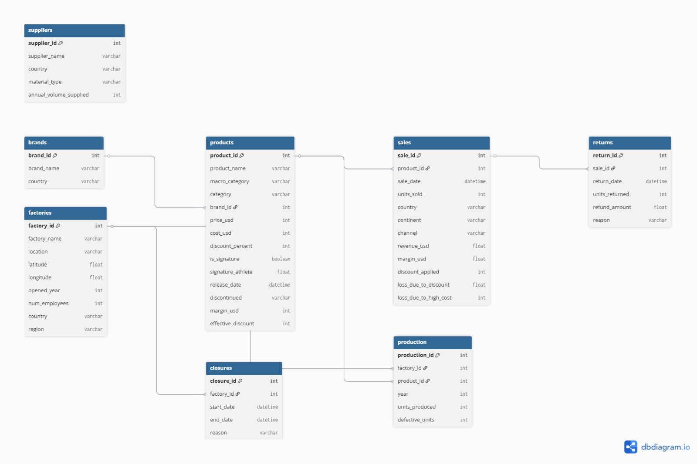

# Siam Thai Fight Manufactory  
Siam Thai Fight Manufactory — Executive Overview  
This project provides key insights on markets, margins, and performance of Siam Thai Fight Manufactory from 2018 to 2023. The analysis covers sales, production, and financial data to support strategic decision-making and operational improvements.

## Project Structure

- **`EDR/`**: Entity-Relationship Diagram (ERD) image illustrating the data model.
- **`SCRIPT/`**: Python scripts including data cleaning ([`Cleaning_Siam.py`](SCRIPT/Cleaning_Siam.py)) and A/B testing analysis ([`Test_A_B.ipynb`](SCRIPT/Test_A_B.ipynb)).
- **`SQL/`**: Jupyter notebook with SQL queries for data aggregation and preparation ([`SQL.ipynb`](SQL/SQL.ipynb)).
- **`VISUAL/`**: Introductory image and links to the interactive Tableau dashboard ([`intro.png`](VISUAL/intro.png)).

## Key Deliverables

### Data Cleaning Script

- [`SCRIPT/Cleaning_Siam.py`](SCRIPT/Cleaning_Siam.py): Python script for cleaning raw sales and product data, currency conversion, channel grouping, and date formatting.

### SQL Analysis

- [`SQL/SQL.ipynb`](SQL/SQL.ipynb): Jupyter notebook containing SQL queries to aggregate and prepare data for visualization and analysis, including sales performance, margins, and discount loss.

### Exploratory Data Analysis & A/B Testing

- [`SCRIPT/Test_A_B.ipynb`](SCRIPT/Test_A_B.ipynb): Jupyter notebook with detailed exploratory data analysis and statistical testing to evaluate the impact of discount strategies.

### Interactive Dashboard (Tableau)

Explore the full interactive dashboard on Tableau Public:

**Quick Overview:** This dashboard provides a comprehensive view of key sales metrics, production efficiency, and financial trends for Siam Thai Fight Manufactory.

### Data Model (ERD)

Visual representation of the database schema showing tables and relationships for efficient querying and data understanding.

  

## Technologies Used

- Python (Pandas, NumPy, Requests)
- SQL
- Jupyter Notebook
- Tableau Public
- GitHub
- Lucidchart

## Author

- Riccardo Lai
